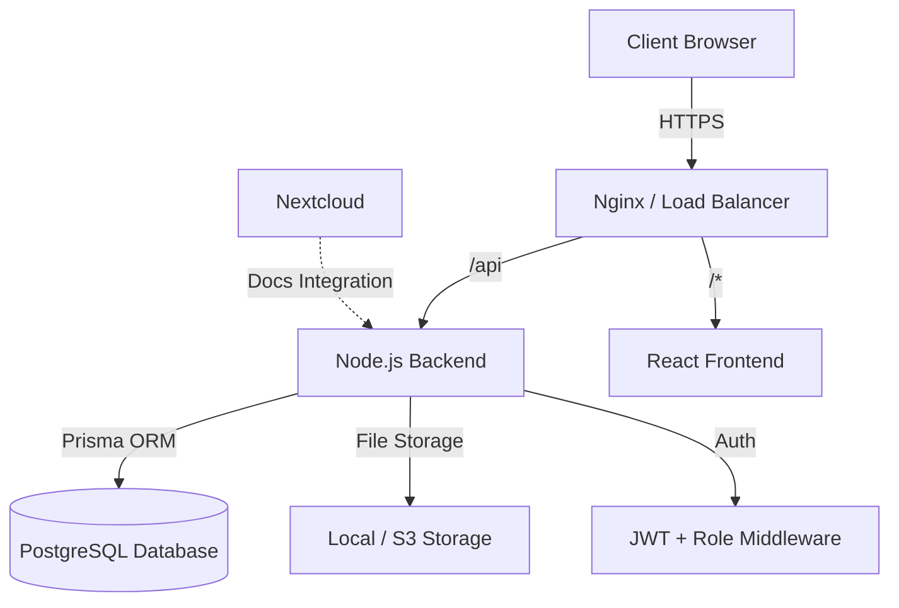

# 🦅 Bigwig Employee Self Service (ESS) Portal

> 🚀 **A Modern, Cloud-Native, White-Label Ready HR Management System**
> Built with performance, scalability, and stunning aesthetics in mind.


---

## 🌟 Overview

The **Bigwig ESS Portal** is a comprehensive Human Resource Management System (HRMS) designed to streamline organizational processes. From attendance tracking to payroll management, it offers a seamless experience for employees, managers, and administrators.

**Key Highlights:**
- **🎨 White-Label Branding:** Fully customizable themes, logos, and login backgrounds per organization.
- **📱 Responsive Design:** Glassmorphism UI that works beautifully on desktop and mobile.
- **☁️ Cloud-Ready:** Containerized with Docker, ready for AWS ECS, DigitalOcean, or any VPS.
- **🔒 Secure:** Role-Based Access Control (RBAC) and JWT authentication.

---

## 🏗️ Application Architecture

The application follows a modern microservices-ready architecture:



| Component | Technology Stack |
|:---|:---|
| **Frontend** | React, Vite, TailwindCSS, Framer Motion, Lucide Icons |
| **Backend** | Node.js, Express, Prisma ORM, Multer |
| **Database** | PostgreSQL 15 |
| **Infrastructure** | Docker, Docker Compose, Nginx |

---

## 📦 Module Workflows

### 1. 🔐 Authentication & Security
- **Workflow:** Users log in via email/password.
- **Features:**
  - Role-based redirection (Employee vs Admin).
  - Secure JWT token handling.
  - **White-label Login:** Displays organization-specific logo, name, and background video/image.

### 2. 📍 Attendance & Tracking
- **Workflow:**
  - Employees "Clock In" and "Clock Out" daily.
  - Geofencing ensures attendance is marked from valid locations.
- **Features:** Real-time status, late-mark tracking, and monthly attendance reports.

### 3. 📅 Leave Management
- **Workflow:**
  - Employee applies for leave (Sick, Casual, Paid).
  - Manager receives notification -> Approves/Rejects.
  - Status updates in real-time.
- **Features:** Leave balance tracking, auto-rejection of invalid dates, Roster integration (Leave = Scheduled Leave).

### 4. 🗓️ Roster Management
- **Workflow:**
  - Managers assign shifts to employees.
  - Supports: **Regular Shift**, **Weekly Off (WO)**, **Govt Holiday (GH)**, **Scheduled Leave (SL)**.
- **Features:** 
  - Auto-defaults weekends to Weekly Off.
  - Visual color-coding (Gray for Off, Green for Work, Red for Holiday).

### 5. 💰 Payroll & Salary
- **Workflow:**
  - HR defines Salary Structure (Basic, HRA, Allowances).
  - Monthly Salary Slips are generated effectively.
- **Features:**
  - **Currency:** All values in **Indian Rupees (₹)**.
  - PDF Download of Salary Slips.
  - Role-based visibility (Managers cannot see sensitive salary data).

### 6. 🤝 Recruitment (TAS)
- **Workflow:**
  - HR posts Jobs -> Candidates Apply.
  - Candidates move through: `Applied -> Screening -> Interview -> Offer -> Hired`.
- **Features:** Assessment integration, candidate database, status tracking workflow.

### 7. 🎨 Organization Branding (Settings)
- **Workflow:**
  - Owner/HR accesses `Branding Settings`.
  - Uploads Logo, Login Background, and sets Primary/Accent colors.
  - Toggles Theme Mode (Dark/Light/System).
- **Outcome:** The entire portal instantly adapts to the new brand identity.

---

## 🚀 Deployment Guide

### Option A: Linux / Ubuntu Server (Automated)

The easiest way to deploy on any Linux server (AWS EC2, Hetzner, DigitalOcean).

**Prerequisites:**
- Ubuntu 20.04+ (Recommended)
- Git
- Docker & Docker Compose v2

**Steps:**

1.  **Clone the Repository:**
    ```bash
    git clone https://github.com/BigwigMediaDigital968/ess.git
    cd ess
    ```

2.  **Configure Environment:**
    ```bash
    cp .env.example .env
    nano .env
    # Set POSTGRES_PASSWORD, JWT_SECRET, and others
    ```

3.  **Run Deployment Script:**
    This script handles everything: builds images, stops old containers, starts new ones, waits for DB, and runs migrations.
    ```bash
    chmod +x deploy.sh
    ./deploy.sh
    ```

4.  **Access:**
    - App: `http://<server-ip>`
    - API: `http://<server-ip>:5000`

---

### Option B: AWS ECS Cluster (Scalable)

For high availability and auto-scaling.

**Pre-requisites:**
- AWS CLI configured
- ECR Repositories created (`ess-backend`, `ess-frontend`)

**Steps:**

1.  **Build & Push Images:**
    ```bash
    # Login to ECR
    aws ecr get-login-password --region <region> | docker login --username AWS --password-stdin <account-id>.dkr.ecr.<region>.amazonaws.com

    # Build & Push Backend
    docker build -t ess-backend ./backend
    docker tag ess-backend:latest <ecr-repo-url>/ess-backend:latest
    docker push <ecr-repo-url>/ess-backend:latest

    # Build & Push Frontend
    docker build -t ess-frontend ./frontend
    docker tag ess-frontend:latest <ecr-repo-url>/ess-frontend:latest
    docker push <ecr-repo-url>/ess-frontend:latest
    ```

2.  **Create Task Definitions:**
    - Create a new Task Definition in ECS (Fargate or EC2).
    - Add Container: **Backend**
        - Image: `<ecr-repo-url>/ess-backend:latest`
        - Port Mappings: 3434
        - Environment Variables: `DATABASE_URL`, `JWT_SECRET`, etc.
    - Add Container: **Frontend**
        - Image: `<ecr-repo-url>/ess-frontend:latest`
        - Port Mappings: 80
        - Environment Variable: `VITE_API_URL` (Point to Load Balancer URL)

3.  **Deploy Service:**
    - Create a Service using the Task Definition.
    - Configure Load Balancer (ALB) to route traffic:
        - Port 80 -> Frontend
        - Path `/api/*` -> Backend
    - Set Desired Tasks (e.g., 2 for high availability).

---

## 🛠️ Development (Local)

To run the project locally for development:

1.  **Start Services:**
    ```bash
    docker compose up -d
    ```

2.  **Access:**
    - Frontend: `http://localhost`
    - Backend: `http://localhost:3434`
    - Nextcloud: `http://localhost:8080`

3.  **Logs:**
    ```bash
    docker compose logs -f
    ```

---

## 📜 License

Private & Confidential. Property of Bigwig Media.
